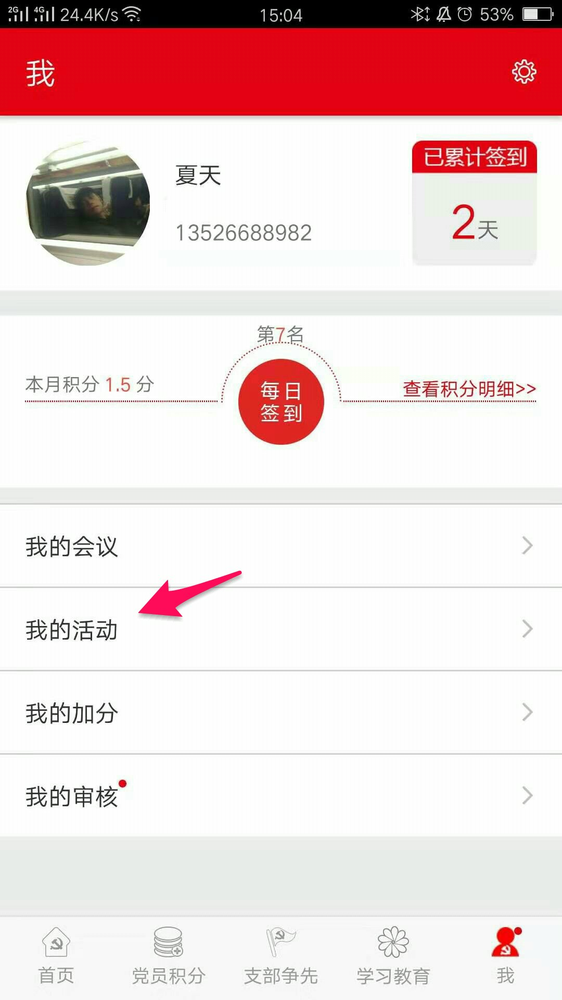

[TOC]

# 党员积分 Android 客户端 APP 使用说明书

##  一 、下载安装说明

1. 用户可以从主流安卓应用商店（华为应用商店、小米应用商店和腾讯宝）下载该 Android 客户端应用。搜索关键字 党员积分 ，如下图所示，并点击 党员积分 APP 进行安装：

2. 由于各应用商店都需要更新审核，周期比较长，为了方便使用，最新的应用更新，会第一时间通过如下二维码进行生成。

3. 推荐用户，优先通过扫描上面的二维码，下载安装该 Android 客户端应用。

## 二 、用户登录注册
#### 后台录入用户信息

1. 系统中所有用户首先要先录入系统才有资格进入，在系统后台：进入用户仓库 >> 选择添加新用户 >> 输入用户的真实姓名和身份证号

#### 注册

1. 打开手机软件，如果没有在软件中注册过账号，点击注册，请先选择注册账号；

2. 注册首先输入在后台录入的真实姓名和身份证号，验证是否有资格注册；

3. 接着必须要选择输入头像、手机号、性别、籍贯、民族、入党时间、党内职务、所在支部和所在小组，以及可选输入参加工作时间、工作岗位、学历等，接着选择下一步；
                        

4. 最后填写了获取的短信验证码，以及登陆密码，最后注册完成；

#### 登录

1. 点击APP;进行登录

## 三、首页说明

#### 首页版面说明

1. 上部分是宣传图片以及新闻；
2. 中间部分是系统添加的月度计划；
3. 下部分是最新的会议和活动列表

#### 创建会议或活动

1. 在首页选择右上角添加会议或者活动；只有党支部书记，党委书记，小组长，以及党建管理员才有权限发起会议；

2. 在添加会议页面选择会议类型，或者输入自定义会议名称，选择会议参与人员，输入会议的主题、日期时间和地点以及备注创建会议。

#### 查看会议或活动详情

1. 在首页或者我的会议列表中点击，查看会议详情；

2. 在会议详情页面，会议开始前20分钟，如果需要请假可以请假，有会议创建者在会议详情页面点击请假审核审核。参加会议室在会议开始前后20分钟可以点击签到。

3. 点击创建的会议可以查看会议详情

4. 在会议未开始前创建会议者可在会议底部选择修改参会人员

## 四、党员积分模块

#### 党员积分列表

1. 模块首页显示登陆用户所在支部的所有人员列表，列表中显示个人积分总和；

2. 点击模块首页右上角按钮，查看所在支部积分的排行情况，切换不同党支部，查看其它支部排行

3. 点击在党员积分排行榜的右上角，可以切换到其他支部，查看其他支部排行榜；

4. 在党员积分页面打分， 点击你要打分的人员，点击三秒不动，就可以进行打分；只有小组长及以上级别有权限进行打分；

5. 积分审核；只有党支部书记及党委书记才有权限审核；

## 五、支部争先模块

#### 支部列表

1. 模块首页每个季度各个支部的得分情况；

2. 点击右上角排行榜，查看历年排行情况；

3. 支部书记在每个季度的前十天对本支部在上个季度的得分情况进行打分

4. 支部书记打分后，党委书记对各个支部的打分情况进行审核；

## 六、 学习教育模块

#### 文章别表和文章详情

1. 点击文章列表，查看文章详情；在文章详情底部，可以查看其它人的评论以及发布自己的评论；

2. 评论文章，每评论一篇文章，系统自动加 0.5 积分，每篇文章每个账号只可以评论一次；

## 七、 我 模块

#### 模块简介

1. 包含了修改个人信息，修改手机号，每日签到等功能，以及还有我参加或者创建的会议和活动，我的个人加分项，以及需要我审核的内容；

#### 每日登录签到

1. 点击 签到 ，签到后系统自动加 0.5 积分；

#### 查看个人积分明细

1. 点击 “查看积分明细”

#### 我的会议

1. 我创建的会议，如果没还没到开始时间，可以在此点击行，进行修改编辑；

2. 列出了我参与的会议和我创建的会议；

#### 我的活动

1. 我创建的活动，如果没还没到开始时间，可以在此点击行，进行修改编辑；

2. 列出了我参与的活动和我创建的会议

#### 我的加分项

1. 查看我的加分项目以及审核进度，添加新的加分项目；

2. 点击右上角加号添加加分项目

3. 添加个人加分项，选择项目，输入内容拍照或者照片选择图片

#### 我的审核

1. 点击我的审核，查看审核文件

2. 点击未审核文件开始审核

####  个人信息

1. 点击头像修改个人的基本信息；

#### 我的设置

1. 点击右上角查看我的设置

2. 修改手机号以及账户密码

3. 查看使用帮助

4. 退出当前账户登录

