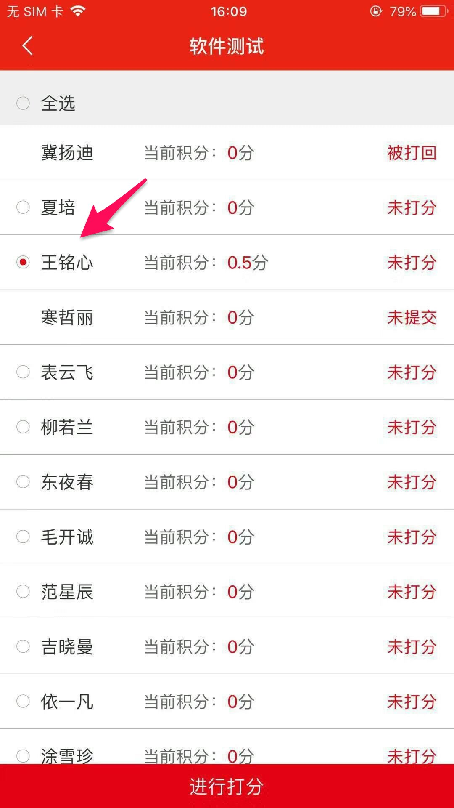

[TOC]

# 党员积分 iOS客户端 APP 使用说明书

## 一、下载安装说明

**客户端可以在苹果应用商店（App Store）中搜索关键字“党员积分”，点击第一个 APP 下载安装即可，如下所示：** 

## 二、用户登录注册

### 后台录入用户信息

1. 所有用户首先要先录入系统才有资格进入，在系统后台：进入用户仓库 >> 选择添加
新用户 >> 输入用户的真实姓名和身份证号。

### 注册

2. 打开手机软件，如果没有在软件中注册过账号，请先选择注册账号。

3. 注册首先输入在后台录入的真实姓名和身份证号，验证是否有资格注册。

4. 接着必须要选择输入：
头像、手机号、性别、籍贯、民族、入党时间、党内职务、所在支部和所在小组，以及可选输入参加工作时间、工作岗位、学历等，接着选择下一步。

5. 最后填写获取了的短信验证码，以及输入两次登陆密码，最后注册完成。

### 登录

6. 打开手机软件，输入注册的手机号和密码，登陆系统。

## 三、首页模块

### 首页版面说明

1. 上部分是宣传图片以及新闻；
中间部分是系统添加的月度计划；
下部分是最新的会议和活动列表；

### 创建会议或活动

2. 在首页选择右上角添加会议。

3. 在添加会议页面选择会议类型，或者输入自定义会议名称，选择会议参与人员，输入会议的主题、日期时间和地点以及备注。

### 查看会议或活动详情

4. 在首页-近期安排可以查看会议详情。

5. 在会议详情页面，会议开始前20分钟，如果需要请假可以请假，由会议创建者在会议详情页面点击请假审核审核。参加会议室在会议开始前后20分钟可以点击签到。会议结束后，（会议发起人）可选择参会人员进行打分。

## 四、党员积分模块

### 党员积分列表

1. 此模块首页显示所有人员列表，以及每个人的积分总和。

### 党员积分打分

2. 
由每个小组组长每月对成员进行打分。

3. 党小组长打分过后，由党支部书记对打分结果进行审核。

### 党员积分排行榜

4. 点击模块首页右上角按钮，可以查看所在支部积分的排行情况；
切换不同党支部，可以查看其它支部排行情况。

## 五、学习教育模块

### 文章别表和文章详情

1. 点击文章列表，查看文章详情；在文章详情底部，可以查看其它人的评论以及发布自己的评论；点击右上角可以分享到微信好友或者微信朋友圈。

## 六、支部争先模块

### 支部列表

1. 
不同级别的人模块是不一样的，小组长及以下的人界面如图所示，只能查看支部积分；

2. 党支部书记模块首页上半部分可进行支部自评以及上传佐证材料的操作，下半部分是每个季度各个支部的得分情况；

3. 
点击右上角排行榜，选中党支部列表自己所属的党支部，查看支部内部排行情况。

## 七、我模块

### 模块简介

1. 包含了修改个人信息、修改手机号、每日签到等功能，以及还有我参加或者创建的会议和活动、我的个人加分项、需要我审核的内容。

### 修改个人信息

2. 
修改部分个人工作信息，点击头像所属部分，进入我的个人信息，点击右上角的笔来编辑个人信息。

### 个人积分

3. 点击签到，增加积分；
点击查看积分明细，查看个人所得积分。

### 我的会议

4. 分别列出了我参与的会议，以及我发起的会议，点击查看详情。与首页的近期安排同步

### 我的活动

5. 分别列出了我参与的活动，以及我发起的活动，点击查看详情。

### 我的加分项

6. 个人的加分项。

7. 添加个人加分项，点击右上角选择项目，输入证书类型，备注，以及上传材料（照片）。

### 我的审核

8. 审核分别是会议加分审核以及个人荣誉审核，点击查看详情，进行审核。

### 修改手机号以及密码

9. 点击右上角，可进行设置，修改手机号，密码，以及清除缓存以及退出登录。

## 八、权限设置

### 会议

会议发起权限设置：

>**党建管理员**，**党小组长**，**党支部书记**，**党委委员**，**党委书记**。

会议打分权限设置：

>**会议发起者**

### 党员积分

打分权限设置：

>**党小组长**

审核权限设置：

>**党支部书记**

### 支部争先

自评发起者权限设置：

>**党支部书记**

审核权限设置：

>**党委书记**

### 我-个人信息

上传加分项：

>**本人**

审核权限设置：

>**党支部书记**

可获得个人积分的项目：

每日签到：+0.5

月度质量：审核者自定义加分

会议质量：审核者自定义加分

活动质量：审核者自定义加分

弹性调整：审核者自定义加分

获得荣誉：审核者自定义加分

文章评论：+0.5

党员之星：审核者自定义加分

